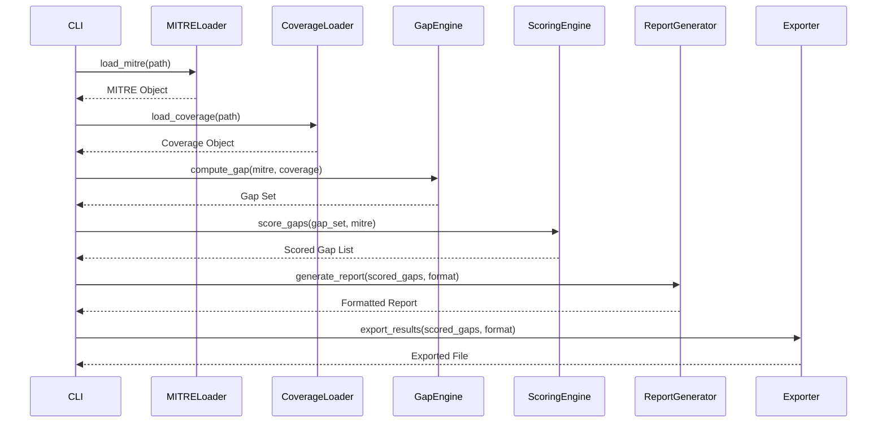

# MITRE ATT&CK Coverage Gap Analyzer - Specifica Tecnica

## 1. Panoramica
Strumento CLI per analizzare le coperture MITRE ATT&CK esistenti (detection rules, Sigma, ecc.) e identificare le tecniche/sottotecniche non coperte, assegnando priorità basate su prevalence, exploitability e disponibilità di data source.

## 2. Architettura a Livello Alto
```
+-------------------+       +---------------------+       +------------------+
|   Input Layer     |       |   Core Analyzer     |       |   Output Layer   |
| (CLI, Parser)     | --->  | (Gap Engine, Scorer)| --->  | (Report, Export) |
+-------------------+       +---------------------+       +------------------+
        ^                         ^                         ^
        |                         |                         |
        |                         |                         |
+-------------------+       +---------------------+       +------------------+
|  MITRE ATT&CK     |       |  Coverage Map       |       |  Templates       |
|  STIX/JSON Loader |       |  Loader (CSV/JSON/YAML) |   |  (MD, HTML, JSON)|
+-------------------+       +---------------------+       +------------------+
```

## 3. Interfaccia CLI
Utilizzo di `typer` (o `argparse`) per una CLI intuitiva.

### 3.1 Struttura Comandi
```
mitre-gap-analyzer [OPZIONI] COMANDO [ARGOMENTI] [OPZIONI_COMANDO]
```

### 3.2 Comandi Principali
- `analyze`: Esegue l'analisi di gap tra MITRE ATT&CK e coverage map fornita.
- `report`: Genera report formattati a partire dai risultati dell'analisi (separato per permettere riuso).
- `export`: Esporta i risultati in vari formati (JSON, CSV, Excel).
- `version`: Mostra la versione dello strumento.
- `help`: Mostra l'aiuto.

### 3.3 Opzioni Globali
- `--mitre-path PERCORSO`: Path al file MITRE ATT&CK STIX JSON (default: ./data/enterprise-attack.json)
- `--coverage-path PERCORSO`: Path al file di coverage map (CSV/JSON/YAML)
- `--output-dir PERCORSO`: Directory per output report (default: ./output)
- `--format FORMATO`: Formato output report (md, html, json) (default: md)
- `--verbose`: Logging dettagliato
- `--quiet`: Solo errori

### 3.4 Esempi di Utilizzo
```bash
# Analisi base
mitre-gap-analyzer analyze --coverage-path ./data/my_sigma_rules.csv

# Analisi con MITRE custom e output HTML
mitre-gap-analyzer analyze --mitre-path ./data/enterprise-attack.json \
    --coverage-path ./data/elastic_rules.json --format html --output-dir ./reports

# Genera report da risultati precedenti (se salvati)
mitre-gap-analyzer report --input ./output/results.json --format md
```

## 4. Core Analyzer
### 4.1 Componenti
- **MITRE Loader**: Carica e parsifica lo STIX 2.1 JSON di MITRE ATT&CK Enterprise.
  - Estrae: tactic, technique, sub-technique, ID, nome, descrizione, data source rilevanti.
  - Normalizza in struttura interna: `{tactic: [{technique_id, technique_name, sub_technique_ids...}]}`
- **Coverage Map Loader**: Supporta múltiples formati:
  - CSV: colonne `technique_id, technique_name, sub_technique_id (opz.), status (covered/partial/not-covered), source`
  - JSON: array di oggetti con campi sopra
  - YAML: simile a JSON
- **Gap Engine**: Confronta MITRE interno con coverage map.
  - Produce dizionario di gap per tactic/technique/sub-technique.
  - Calcola metriche: percentuale copertura per tactic, numero totale tecniche mancanti.
- **Scoring Engine**: Assegna priorità a ciascuna tecnica mancante.
  - Fattori:
    - **Prevalence**: peso basato su frequenza osservata in threat intelligence (se disponibile in MITRE como `x_mitre_prevalence`).
    - **Exploitability**: peso basato su presenza di exploit pubblici (se disponibile).
    - **Data Source Availability**: peso basato sul numero e tipo di data source richiesti per la detection (più fonti richieste = più difficile da coprire -> priorità più alta? oppure inverso? Definiamo: più data source disponibili = più facile da coprire -> priorità più bassa se mancante ma molti data source disponibili).
    - **Difficoltà di Implementazione**: stimata da complessità della tecnica (numero di sub-techniche, ecc.).
  - Formula di punteggio (esempio):
    ```
    score = w1*prevalence_norm + w2*exploitability_norm + w3*(1 - data_source_norm) + w4*complexity_norm
    ```
    dove ogni fattore è normalizzato 0-1 e i pesi sommano a 1 (default: w1=0.4, w2=0.3, w3=0.2, w4=0.1).
  - Output: lista di tecniche mancanti ordinate per score decrescente.

### 4.2 Flussi di Dati
1. CLI parsifica argomenti e chiama `analyze`.
2. `analyze` carica MITRE STIX -> oggetto MITRE.
3. Carica coverage map -> oggetto Coverage.
4. Gap Engine calcola:
   - `covered_set` = set di (tactic, technique, [sub-technique]) presenti in coverage.
   - `mitre_set` = set equivalente da MITRE.
   - `gap_set` = mitre_set - covered_set.
5. Per ciascun elemento in `gap_set`, lo Scoring Engine calcola punteggio.
6. Risultati restituiti come struttura:
   ```json
   {
     "metadata": {...},
     "summary": {
       "total_techniques": 191,
       "covered_techniques": 145,
       "coverage_percentage": 75.9,
       "tactics": [...]
     },
     "gaps": [
       {
         "tactic": "initial-access",
         "technique_id": "T1195",
         "technique_name": "Supply Chain Compromise",
         "sub_technique_id": null,
         "score": 0.87,
         "prevalence": 0.6,
         "exploitability": 0.9,
         "data_source_count": 2,
         "complexity": 0.5
       },
       ...
     ]
   }
   ```
7. Il modulo `report` prende questa struttura e genera output secondo il template.
8. Il modulo `export` può salvare la struttura grezza in JSON/CSV.

### 4.3 Gestione Errori e Log
- Logging tramite `logging` standard di Python.
- Eccezioni personalizzate per file mancanti, formato non supportato, ecc.
- In caso di errore critico, lo strumento termina con codice di uscita != 0 e messaggio su stderr.

## 5. Dipendenze
- Python 3.9+
- Pacchetti richiesti (da inserire in `requirements.txt`):
  - typer[all] >=0.9.0
  - pyyaml >=6.0
  - stix2 >=3.0.0 (per parsing STIX JSON)
  - rich >=13.0.0 (per output CLI colorato)
  - tabulate >=0.9.0 (per tabelle in report markdown)
  - pandas >=2.0.0 (opzionale, per gestione CSV avanzata)
  - openpyxl >=3.1.0 (per export Excel)

## 6. Licenza
Il progetto sarà rilasciato sotto licenza MIT (permettere uso commerciale e modifiche).

## 7. Piano di Sviluppo (per questa fase)
- [x] Definire struttura CLI e comandi
- [x] Progettare classi core: MITRELoader, CoverageLoader, GapEngine, ScoringEngine
- [x] Definire formato dati interno e risultati
- [x] Creare diagrammi architettura (Mermaid)
- [ ] (Nella fase successiva) Implementare effettivamente i moduli.

## 8. Diagrammi Mermaid

### 8.1 Architettura a Livello Alto (già mostrata sopra, ripetuta in Mermaid)
```mermaid
graph TD
    A[Input Layer] --> B[Core Analyzer]
    B --> C[Output Layer]
    A1[MITRE ATT&CK STIX/JSON Loader] --> B
    A2[Coverage Map Loader (CSV/JSON/YAML)] --> B
    B1[Gap Engine] --> B
    B2[Scoring Engine] --> B
    C1[Report Templates (MD/HTML/JSON)] --> C
    C2[Export Module (JSON/CSV/Excel)] --> C
```

### 8.2 Flusso di Analisi Dettagliato


## 9. Prossimi Passi (Fase 3)
Implementare i moduli Python secondo questa specifica, iniziando da MITRELoader e CoverageLoader.

---
*Documento generato il: 2026-09-09*